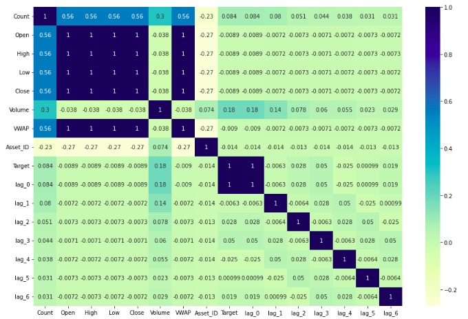

* This is a classic regression combined with time series problem to be solved using Machine Learning.

## Project Introduction
* Cryptocurrencies are one of the most popular assets for speculation and investments but they are highly volatile. The fluctuating nature causes both hype and risk. 
* Crypto Forecasting is a process of utilizing the time-series data of given cypto currencies along with other features to predict the future value of these crypto currencies by analysing the past trends and data.
* Through Crypto Forecasting, we intend to forecast short term return in 14 popular cryptocurencies using Machine Learning. 

## Results
* 
* 
* 
* 
* 
* 
* 
* 

## References
1. [A Comprehensive Guide to Time Series Analysis - Analytics Vidhya](https://www.analyticsvidhya.com/blog/2021/10/a-comprehensive-guide-to-time-series-analysis/)
2. [Time-Series Forecasting with Spark ML: Part — 1](https://medium.com/analytics-vidhya/time-series-forecasting-with-spark-ml-part-1-4e888144ad27/)
3. [G-Research Crypto Forecasting](https://www.kaggle.com/c/g-research-crypto-forecasting/data)
4. [The Complete Guide to Time Series Analysis and Forecasting](https://towardsdatascience.com/the-complete-guide-to-time-series-analysis-and-forecasting-70d476bfe775)
5. [Learn Time Series Tutorials](https://www.youtube.com/watch?v=FPM6it4v8MY&ab_channel=GreatLearning)
6. [How-To Guide on Exploratory Data Analysis for Time Series Data](https://medium.com/analytics-vidhya/how-to-guide-on-exploratory-data-analysis-for-time-series-data-34250ff1d04f)
7. [Exploratory Data Analysis - Kaggle Source](https://www.kaggle.com/code/sytuannguyen/crypto-eda)
8. [Tuning Hyperparameter with Optuna](https://app.pitch.com/app/presentation/918f21f3-881e-4f70-94bf-d364348ae85d/3255e9e7-860e-4e0f-a855-f0100c99c525/d96cc9d3-8a99-4919-a64c-0992ec3efd8e)
9. [Guide to LightGBM Hyperparameter Tuning with Optuna](https://towardsdatascience.com/kagglers-guide-to-lightgbm-hyperparameter-tuning-with-optuna-in-2021-ed048d9838b5)
10. [Grid Search for Model Tuning](https://towardsdatascience.com/grid-search-for-model-tuning-3319b259367e)
11. [Tune Hyperparameters with GridSearchCV](https://www.analyticsvidhya.com/blog/2021/06/tune-hyperparameters-with-gridsearchcv/#:~:text=Grid%20Search%20uses%20a%20different,the%20number%20of%20hyperparameters%20involved.)


# User's Guide
## Prerequisite (Installation required)
* Python
* pip

## Installation Guide

#### Download the dataset
* Download the dataset from the [link here](https://www.kaggle.com/c/g-research-crypto-forecasting/data)
* Extract the folder
* Rename the folder to Dataset and place it in the root directory of this repo.

#### Install Jupyter Notebook
```bash
pip install jupyter notebook
jupyter notebook
```

#### Clone the repo
```bash
git clone https://github.com/kashvi05/CryptoPolice.git
```

#### Run the notebooks
* First run Installation.ipnyb to ensure that you have the necessary packages required for this project to run.
* Then, run Preprocessing.ipnyb so as to handle null values and reduce the size of dataset by combining the values for one day.
* Then, run Exploratory Data Analysis.ipnyb to get insigts about the dataset.
* Then, run Feature Engineering.ipnyb which takes care of outliers, lag features and feature selection.
* After that, run Model Fitting.ipnyb which fits basic machine learning and time series models
* Finally, run Optimization.ipnyb which find the best set of hyperparameters with lowest error rate.


#### Note
* Some of the EDA code has been moved to Kaggle notebook.
